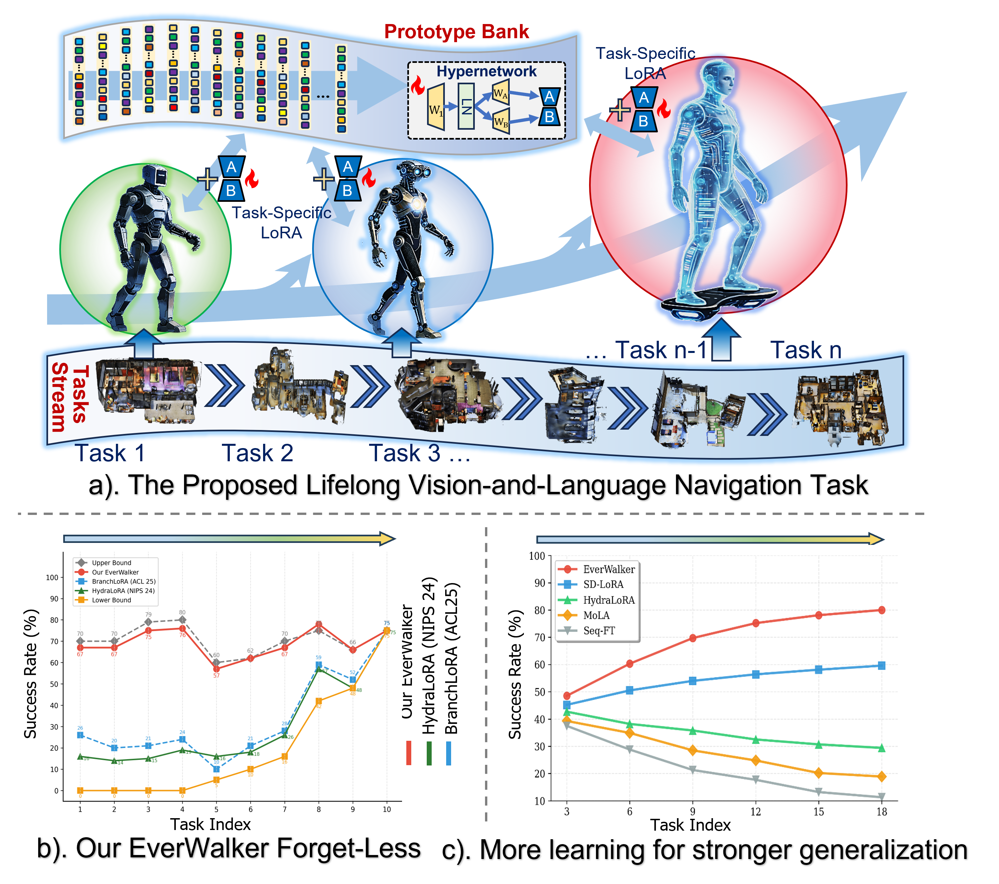
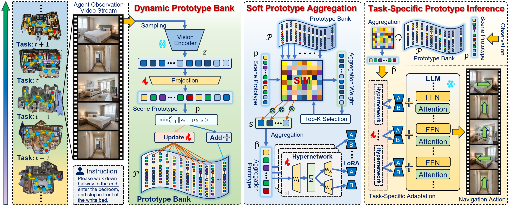

# Evolving the Prototype Journey:  Lifelong Vision-and-Language Navigation with Prototype Adaptation


<div align="center">

</div>


---

## 📌 Overview

**EverWalker** is a novel framework for **lifelong vision-and-language navigation (LVLN)** that enables navigation agents to continually learn new tasks without catastrophic forgetting. Our method achieves state-of-the-art performance through three key innovations:

<div align="center">

<p><i>ProtoStream enables lifelong learning across diverse navigation scenes and instruction styles</i></p>
</div>

- 🧩 **Dynamic Prototype Bank**: Automatically grows to capture scene knowledge with soft routing mechanism
- 🔧 **HyperNetwork**: Generates step-level LoRA adaptations conditioned on weighted prototypes
- 🎯 **Multi-Level Distillation**: Novel HyperNet output distillation to prevent both prototype drift and mapping instability


---

## ✨ Key Features

### Lifelong Learning without Forgetting
- ✅ **Only 4.3% forgetting rate** (11% improvement over baselines)
- ✅ **67.3% average success rate** across 18 continual tasks
- ✅ **Strong zero-shot generalization** to unseen scenes

### Efficient and Scalable
- ⚡ **4% computational overhead**: Minimal additional cost
- 🔄 **Dynamic adaptation**: Step-level LoRA generation

### Comprehensive Framework
- 🎓 Based on StreamVLN with Qwen-7B backbone
- 🏗️ Modular design: Easy to extend and customize
- 📊 Complete evaluation suite with multiple metrics

---

## 🏗️ Architecture

### System ComponentsKey Innovations

**1. Dynamic Prototype Bank**

```python
# Soft routing over ALL prototypes (not top-k)
similarities = cosine_similarity(z_t, prototypes)  # (K,)
weights = softmax(similarities / temperature)       # (K,)
weighted_proto = sum(weights * prototypes)         # (512,)
```

**2. HyperNetwork Design**

```python
# Step-level LoRA generation
for layer_size in unique_sizes:
    lora_A = generator_A(weighted_proto)  # rank × in_dim
    lora_B = generator_B(weighted_proto)  # out_dim × rank
```

**3. Multi-Level Distillation**
```python
# Complete distillation chain
L_total = L_task                    # Task loss
        + λ_sp * L_sp              # Single-proto KL
        + λ_pp * L_pp              # Proto-pair cosine
        + λ_cp * L_cp              # Cross-proto MSE
        + λ_lora * L_lora          # HyperNet output (NEW!)
        + λ_div * L_div            # Diversity loss
```

---

## 🚀 Getting Started

### Prerequisites

- Python 3.8+
- PyTorch 2.0+
- CUDA 11.7+ (for GPU support)
- 8× NVIDIA A6000 GPUs (or equivalent, 48GB VRAM each)

### Installation

```bash
# Clone the repository
git clone https://github.com/Lifelong-EverWalker/EverWalker.git
cd EverWalker

# Create conda environment
conda create -n protostream python=3.8
conda activate EverWalker

# Install dependencies
pip install -r requirements.txt

# Install habitat-sim (for VLN simulation)
conda install habitat-sim -c conda-forge -c aihabitat
```

### Quick Start

#### 1. Prepare Data

```bash
# Download StreamVLN dataset
python scripts/download_dataset.py

# Preprocess data
python scripts/preprocess_data.py
```

#### 2. Train EverWalker

```bash
# Single GPU training (for debugging)
python streamvln_train.py \
    --config config/vln_r2r.yaml \
    --use_protostream \
    --output_dir outputs/protostream_debug

# Multi-GPU training (recommended)
bash scripts/streamvln_train_protostream.sh
```

#### 3. Evaluate

```bash
# Evaluate on all tasks
python streamvln_eval.py \
    --checkpoint outputs/protostream/checkpoints/task_1.pth \
    --config config/vln_r2r.yaml \
    --output_dir outputs/evaluation
```


---

## 📁 Project Structure

```
EverWalker/
├── config/                          # Configuration files
│   └── vln_r2r.yaml                # StreamVLN R2R config
│
├── llava/                           # Vision-language model
│
├── scripts/                         # Training and evaluation scripts
│   ├── streamvln_train_protostream.sh
│   ├── zero2.json                  # DeepSpeed config
│   └── zero3.json
│
├── streamvln/                       # Main source code
│   ├── model/                       # Model implementations
│   │   ├── continual_learning.py   # Continual learning utils
│   │   ├── hyper_lora_layers.py    # HyperNetwork generators
│   │   ├── prototype_manager.py    # Prototype bank management
│   │   ├── scene_encoder.py        # Scene feature encoder
│   │   ├── triple_distillation.py  # Multi-level distillation
│   │   └── stream_video_vln.py     # Main VLN model
│   │
│   ├── dataset/                     # Data processing
│   ├── habitat_extensions/          # Habitat simulator extensions
│   └── utils/                       # Utility functions
│       ├── dist.py                  # Distributed training
│       └── utils.py
│
├── streamvln_train.py              # Training script
├── streamvln_eval.py               # Evaluation script
├── streamvln_eval_baseline.py      # Baseline evaluation
├── args.py                          # Argument parser
├── measures.py                      # Evaluation metrics
├── maps.py                          # Navigation maps
│
├── requirements.txt                 # Python dependencies
└── README.md                        # This file
```

---

## 🎯 Reproducing Results

### Expected Outputs

After training completes, you should see:

```
outputs/
├── EverWalker/
│   ├── checkpoints/
│   │   ├── task_1.pth
│   │   ├── task_2.pth
│   │   └── ...
│   ├── prototypes/
│   │   ├── task_1_protos.npy
│   │   └── ...
│   ├── teacher_loras/
│   │   └── ...
│   └── logs/
│       └── training.log
│
└── results/
    ├── task_wise_sr.json
    ├── forgetting_rate.json
    └── ablation_results.json
```
